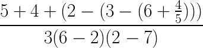

# [Глава 1. Построение абстракций с помощью процедур](index.md)

## Упражнение 1.2
Переведите следующее выражение в префиксную форму:

### Решение

[Код](../../src/chapter01/exercise_1_02.rkt) | [Тест](../../test/chapter01/test_exercise_1_02.rkt)
--- | ---
