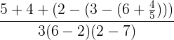

# [Глава 1. Построение абстракций с помощью процедур](index.md#Глава-1-Построение-абстракций-с-помощью-процедур)
## [1.1 Элементы программирования](index.md#11-Элементы-программирования)

### Упражнение 1.2
Переведите следующее выражение в префиксную форму:

#### Решение

[Код](../../src/chapter01/exercise_1_02.rkt) | [Тест](../../test/chapter01/test_exercise_1_02.rkt)
--- | ---
