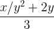

# [Глава 1. Построение абстракций с помощью процедур](index.md)

## Упражнение 1.8
Метод Ньютона для кубических корней основан на том, что если y является
приближением к кубическому корню из x, то мы можем получить лучшее приближение
по формуле:

С помощью этой формулы напишите процедуру вычисления кубического корня, подобную
процедуре для квадратного корня. (В разделе 1.3.4 мы увидим, что можно
реализовать общий метод Ньютона как абстракцию этих процедур для квадратного и
кубического корня.)

### Решение
