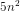
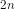
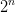
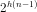

# [Глава 1. Построение абстракций с помощью процедур](index.md#Глава-1-Построение-абстракций-с-помощью-процедур)
## [1.2. Процедуры и порождаемые ими процессы](index.md#12-Процедуры-и-порождаемые-ими-процессы)

### Упражнение 1.10
Следующая процедура вычисляет математическую функцию, называемую функцией
Аккермана.

```racket
(define (A x y)
  (cond ((= y 0) 0)
        ((= x 0) (* 2 y))
        ((= y 1) 2)
        (else (A (- x 1)
                 (A x (- y 1))))))
```

Каковы значения следующих выражений?

```racket
(A 1 10)

(A 2 4)

(A 3 3)
```

Рассмотрим следующие процедуры, где `A` — процедура, определённая выше:

```racket
(define (f n) (A 0 n))

(define (g n) (A 1 n))

(define (h n) (A 2 n))

(define (k n) (* 5 n n))
```

Дайте краткие математические определения функций, вычисляемых процедурами `f`,
`g` и `h` для положительных целых значений `n`. Например, `(k n)` вычисляет
значение функции .

#### Решение

```racket
(A 1 10)
; => 1024

(A 2 4)
; => 65536

(A 3 3)
; => 65536
```

- Процедура `f` вычисляет значение функции .
- Процедура `g` вычисляет значение функции .
- Процедура `h` вычисляет значение функции .

[Код](../../src/chapter01/exercise_1_10.rkt) | [Тест](../../test/chapter01/test_exercise_1_10.rkt)
--- | ---
