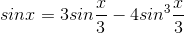

# [Глава 1. Построение абстракций с помощью процедур](index.md#Глава-1-Построение-абстракций-с-помощью-процедур)
## [1.2. Процедуры и порождаемые ими процессы](index.md#12-Процедуры-и-порождаемые-ими-процессы)

### Упражнение 1.15
Синус угла (заданного в радианах) можно вычислить, если воспользоваться
приближением _sin x ≈ x_ при малых _x_ и употребить тригонометрическое тождество



для уменьшения значения аргумента _sin_. (В этом упражнении мы будем считать,
что угол «достаточно мал», если он не больше 0.1 радиана.) Эта идея используется
в следующих процедурах:

```racket
(define (cube x) (* x x x))

(define (p x) (- (* 3 x) (* 4 (cube x))))

(define (sine angle)
  (if (not (> (abs angle) 0.1))
      angle
      (p (sine (/ angle 3.0)))))
```
1.  Сколько раз вызывается процедура `p` при вычислении `(sine 12.15)`?
2.  Каковы порядки роста в терминах количества шагов и используемой памяти (как
функция _α_) для процесса, порождаемого процедурой `sine` при вычислении `(sine α)`?

#### Решение
1.  Процедура `p` вызывается в процедуре `sine` с аргументом `angle/3.0`, то
    есть начальный угол делится на три при каждом вызове процедуры `sine`. Чтобы
    найти количество выполняемых шагов процедуры `sine` с аргументом `12.15`,
    необходимо найти такое `n`, что x/3ⁿ ≤ 0.1 ≤ x/3ⁿ⁻¹.

    12.15/3ⁿ ≤ 0.1 ≤ 12.15/3ⁿ⁻¹

    Умножим все части неравенства на 10 ∙ 3ⁿ.

    121.5 ≤ 3ⁿ ≤ 364.5

    Не трудно заметить, для того, чтобы выполнялось неравенство, `n` должно
    равняться 5. Соответственно, число шагов процедуры `(sine 12.15)` равно 5.

2.  При вычислении процедуры порядок роста функции _sin x_ не зависит от процедур
    `p`, `abs`, `cube`. Так как они не влияют на общую сложность алгоритма, она
    постоянна. На сложность только влияет количество рекурсивных итераций
    процедуры `sine`, которое равно _log₃(10α)_.

    Количество памяти растёт линейно, по мере увеличения количества шагов. Таким
    образом, порядок роста числа шагов и памяти для процедуры `sine` оценивается
    как _Θ(log(n))_.

    [Код](../../src/chapter01/exercise_1_15.rkt) | [Тест](../../test/chapter01/test_exercise_1_15.rkt)
    --- | ---
