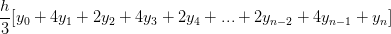

# [Глава 1. Построение абстракций с помощью процедур](index.md#Глава-1-Построение-абстракций-с-помощью-процедур)
## [1.3. Формулирование абстракций с помощью процедур высших порядков](index.md#13-Формулирование-абстракций-с-помощью-процедур-высших-порядков)

### Упражнение 1.29
Правило Симпсона — более точный метод численного интегрирования, чем
представленный выше. С помощью правила Симпсона интеграл функции _f_ между _a_ и
_b_ приближенно вычисляется в виде



где _h_ = (_b_ − _a_)/_n_, для какого-то чётного целого числа _n_, а _yₖ_ =
_f_(_a_ + _kh_). (Увеличение _n_ повышает точность приближенного вычисления.)
Определите процедуру, которая принимает в качестве аргументов _f_, _a_, _b_ и
_n_, и возвращает значение интеграла, вычисленное по правилу Симпсона. С помощью
этой процедуры проинтегрируйте `cube` между 0 и 1 (с _n_ = 100 и _n_ = 1000) и
сравните результаты с процедурой `integral`, приведённой выше.

#### Решение
Результаты для процедуры `integral`, которая приведена выше, выглядят следующим
образом:

```racket
(integral cube 0 1 0.01)
; => 0.24998750000000042

(integral cube 0 1 0.001)
; => 0.249999875000001
```
Для процедуры, которую нам было необходимо реализовать:

```racket
(simpson cube 0 1 100.0)
; => 0.24999999999999992

(simpson cube 0 1 1000.0)
; => 0.2500000000000003
```

Очевидно, что реализованная процедура `simpson` вычисляет интеграл гораздо
точнее, чем `integral`.

[Код](../../src/chapter01/exercise_1_29.rkt) | [Тест](../../test/chapter01/test_exercise_1_29.rkt)
--- | ---
