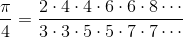

# [Глава 1. Построение абстракций с помощью процедур](index.md#Глава-1-Построение-абстракций-с-помощью-процедур)
## [1.3. Формулирование абстракций с помощью процедур высших порядков](index.md#13-Формулирование-абстракций-с-помощью-процедур-высших-порядков)

### Упражнение 1.31
а. Процедура `sum` — всего лишь простейшая из обширного множества подобных
абстракций, которые можно выразить через процедуры высших порядков. Напишите
аналогичную процедуру под названием `product`, которая вычисляет произведение
значений функции в точках на указанном интервале. Покажите, как с помощью этой
процедуры определить `factorial`. Кроме того, при помощи `product` вычислите
приближенное значение _π_ по формуле

б. Если Ваша процедура `product` порождает рекурсивный процесс, перепишите ее
так, чтобы она порождала итеративный. Если она порождает итеративный процесс,
перепишите ее так, чтобы она порождала рекурсивный.

#### Решение
Процесс | Код | Тест
--- | --- | ---
Рекурсивный | [Просмотр](../../src/chapter01/exercise_1_31r.rkt) | [Просмотр](../../test/chapter01/exercise_1_31r-test.rkt)
Итеративный | [Просмотр](../../src/chapter01/exercise_1_31i.rkt) | [Просмотр](../../test/chapter01/exercise_1_31i-test.rkt)
