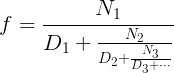
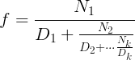

# [Глава 1. Построение абстракций с помощью процедур](index.md#Глава-1-Построение-абстракций-с-помощью-процедур)
## [1.3. Формулирование абстракций с помощью процедур высших порядков](index.md#13-Формулирование-абстракций-с-помощью-процедур-высших-порядков)

### Упражнение 1.37
а. Бесконечная _цепная дробь_ (continued fraction) есть выражение вида



В качестве примера можно показать, что расширение бесконечной цепной дроби при
всех _Nᵢ_ и _Dᵢ_ , равных 1, дает 1/_φ_, где _φ_ — золотое сечение (описанное в
разделе 1.2.2). Один из способов вычислить цепную дробь состоит в том, чтобы
после заданного количества термов оборвать вычисление. Такой обрыв — так
называемая _конечная цепная дробь_ (finite continued fraction) из _k_ элементов,
— имеет вид



Предположим, что _n_ и _d_ — процедуры одного аргумента (номера элемента _i_),
возвращающие _Nᵢ_ и _Dᵢ_ элементов цепной дроби. Определите процедуру `cont-frac`
так, чтобы вычисление `(cont-frac n d k)` давало значение _k_-элементной конечной
цепной дроби. Проверьте свою процедуру, вычисляя приближения к 1/_φ_ с помощью

```racket
(cont-frac (lambda (i) 1.0)
           (lambda (i) 1.0)
           k)
```

для последовательных значений _k_. Насколько большим пришлось сделать _k_, чтобы
получить приближение, верное с точностью 4 цифры после запятой?

б. Если Ваша процедура `cont-frac` порождает рекурсивный процесс, напишите
вариант, который порождает итеративный процесс. Если она порождает итеративный
процесс, напишите вариант, порождающий рекурсивный процесс.

#### Решение
Количество затрачиваемых итераций для получения приближения с точностью до 4
знаков после запятой равно 13.

Процесс | Код | Тест
--- | --- | ---
Рекурсивный | [Просмотр](../../src/chapter01/exercise_1_37r.rkt) | [Просмотр](../../test/chapter01/test_exercise_1_37r.rkt)
Итеративный | [Просмотр](../../src/chapter01/exercise_1_37i.rkt) | [Просмотр](../../test/chapter01/test_exercise_1_37i.rkt)
