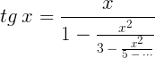

# [Глава 1. Построение абстракций с помощью процедур](index.md#Глава-1-Построение-абстракций-с-помощью-процедур)
## [1.3. Формулирование абстракций с помощью процедур высших порядков](index.md#13-Формулирование-абстракций-с-помощью-процедур-высших-порядков)

### Упражнение 1.39
Представление тангенса в виде цепной дроби было опубликовано в 1770 году немецким
математиком Й.Х. Ламбертом:

где _x_ дан в радианах. Определите процедуру `(tan-cf x k)`, которая вычисляет
приближение к тангенсу на основе формулы Ламберта. K указывает количество термов,
которые требуется вычислить, как в [упражнении 1.37](exercise_1_37.md#Упражнение-137).

#### Решение
[Код](../../src/chapter01/exercise_1_39.rkt) | [Тест](../../test/chapter01/test_exercise_1_39.rkt)
--- | ---
