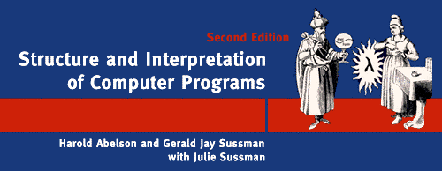

# [Структура и интерпретация компьютерных программ](../../README.md#Структура-и-интерпретация-компьютерных-программ)

## Глава 1. Построение абстракций с помощью процедур
### 1.1 Элементы программирования
  * [Упражнение 1.1](exercise_1_01.md#Упражнение-11)
  * [Упражнение 1.2](exercise_1_02.md#Упражнение-12)
  * [Упражнение 1.3](exercise_1_03.md#Упражнение-13)
  * [Упражнение 1.4](exercise_1_04.md#Упражнение-14)
  * [Упражнение 1.5](exercise_1_05.md#Упражнение-15)
  * [Упражнение 1.6](exercise_1_06.md#Упражнение-16)
  * [Упражнение 1.7](exercise_1_07.md#Упражнение-17)
  * [Упражнение 1.8](exercise_1_08.md#Упражнение-18)

### 1.2. Процедуры и порождаемые ими процессы
  * [Упражнение 1.9](exercise_1_09.md#Упражнение-19)
  * [Упражнение 1.10](exercise_1_10.md#Упражнение-110)
  * [Упражнение 1.11](exercise_1_11.md#Упражнение-111)
  * [Упражнение 1.12](exercise_1_12.md#Упражнение-112)
  * [Упражнение 1.13](exercise_1_13.md#Упражнение-113)
  * [Упражнение 1.14](exercise_1_14.md#Упражнение-114)
  * [Упражнение 1.15](exercise_1_15.md#Упражнение-115)
  * [Упражнение 1.16](exercise_1_16.md#Упражнение-116)
  * [Упражнение 1.17](exercise_1_17.md#Упражнение-117)
  * [Упражнение 1.18](exercise_1_18.md#Упражнение-118)
  * [Упражнение 1.19](exercise_1_19.md#Упражнение-119)
  * [Упражнение 1.20](exercise_1_20.md#Упражнение-120)
  * [Упражнение 1.21](exercise_1_21.md#Упражнение-121)
  * [Упражнение 1.22](exercise_1_22.md#Упражнение-122)
  * [Упражнение 1.23](exercise_1_23.md#Упражнение-123)
  * [Упражнение 1.24](exercise_1_24.md#Упражнение-124)
  * [Упражнение 1.25](exercise_1_25.md#Упражнение-125)
  * [Упражнение 1.26](exercise_1_26.md#Упражнение-126)
  * [Упражнение 1.27](exercise_1_27.md#Упражнение-127)
  * [Упражнение 1.28](exercise_1_28.md#Упражнение-128)

### 1.3. Формулирование абстракций с помощью процедур высших порядков
  * [Упражнение 1.29](exercise_1_29.md#Упражнение-129)
  * [Упражнение 1.30](exercise_1_30.md#Упражнение-130)
  * [Упражнение 1.31](exercise_1_31.md#Упражнение-131)
  * [Упражнение 1.32](exercise_1_32.md#Упражнение-132)
  * [Упражнение 1.33](exercise_1_33.md#Упражнение-133)
  * [Упражнение 1.34](exercise_1_34.md#Упражнение-134)
  * [Упражнение 1.35](exercise_1_35.md#Упражнение-135)
  * [Упражнение 1.36](exercise_1_36.md#Упражнение-136)
  * [Упражнение 1.37](exercise_1_37.md#Упражнение-137)
  * [Упражнение 1.38](exercise_1_38.md#Упражнение-138)
  * [Упражнение 1.39](exercise_1_39.md#Упражнение-139)
  * [Упражнение 1.40](exercise_1_40.md#Упражнение-140)
  * [Упражнение 1.41](exercise_1_41.md#Упражнение-141)
  * [Упражнение 1.42](exercise_1_42.md#Упражнение-142)
  * [Упражнение 1.43](exercise_1_43.md#Упражнение-143)
  * [Упражнение 1.44](exercise_1_44.md#Упражнение-144)
  * [Упражнение 1.45](exercise_1_45.md#Упражнение-145)
  * [Упражнение 1.46](exercise_1_46.md#Упражнение-146)
