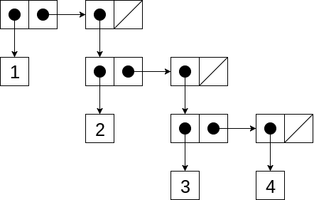

# [Глава 2. Построение абстракций с помощью данных](index.md#Глава-2-Построение-абстракций-с-помощью-данных)
## [2.2 Иерархические данные и свойство замыкания](index.md#22-Иерархические-данные-и-свойство-замыкания)

### Упражнение 2.24
Предположим, мы вычисляем выражение `(list 1 (list 2 (list 3 4)))`. Укажите,
какой результат напечатает интерпретатор, изобразите его в виде стрелочной
диаграммы, а также его интерпретацию в виде дерева (как на рисунке 2.6).

#### Решение
Интерпретатор выдаст следующий результат вычисленного выражения:

```racket
'(1 (2 (3 4)))
```

Изобразим этот список списков в виде стрелочной диаграммы.



Интерпретация в виде дерева будет выглядеть следующим образом:


