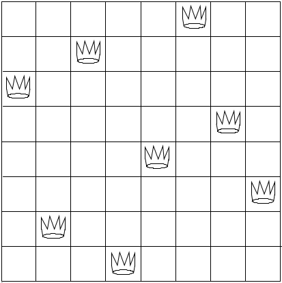

# [Глава 2. Построение абстракций с помощью данных](index.md#Глава-2-Построение-абстракций-с-помощью-данных)
## [2.2 Иерархические данные и свойство замыкания](index.md#22-Иерархические-данные-и-свойство-замыкания)

### Упражнение 2.42
В «задаче о восьми ферзях» спрашивается, как расставить на шахматной доске восемь
ферзей так, чтобы ни один из них не бил другого (то есть никакие два ферзя не
должны находиться на одной вертикали, горизонтали или диагонали). Одно из возможных
решений показано на рисунке. Один из способов решать эту задачу состоит в том,
чтобы идти поперек доски, устанавливая по ферзю в каждой вертикали. После того,
как _k_ − 1 ферзя мы уже разместили, нужно разместить _k_-го в таком месте, где
он не бьет ни одного из тех, которые уже находятся на доске. Этот подход можно
сформулировать рекурсивно: предположим, что мы уже породили последовательность
из всех возможных способов разместить _k_ − 1 ферзей на первых _k_ − 1 вертикалях
доски. Для каждого из этих способов мы порождаем расширенный набор позиций,
добавляя ферзя на каждую горизонталь _k_-й вертикали. Затем эти позиции нужно
отфильтровать, оставляя только те, где ферзь на _k_-й вертикали не бьется ни одним
из остальных. Продолжая этот процесс, мы породим не просто одно решение, а все
решения этой задачи.



Это решение мы реализуем в процедуре `queens`, которая возвращает последовательность
решений задачи размещения _n_ ферзей на доске _n_ × _n_. В процедуре `queens`
есть внутренняя процедура `queen-cols`, которая возвращает последовательность
всех способов разместить ферзей на первых _k_ вертикалях доски.

```racket
(define (queens board-size)
  (define (queen-cols k)
    (if (= k 0)
        (list empty-board)
        (filter
         (lambda (positions) (safe? k positions))
         (flatmap
          (lambda (rest-of-queens)
            (map (lambda (new-row)
                   (adjoin-position new-row k rest-of-queens))
                 (enumerate-interval 1 board-size)))
          (queen-cols (- k 1))))))
  (queen-cols board-size))
```

В этой процедуре `rest-of-queens` есть способ размещения _k_ − 1 ферзя на первых
_k_ − 1 вертикалях, а `new-row` &mdash; это горизонталь, на которую предлагается
поместить ферзя с _k_-й вертикали. Завершите эту программу, реализовав представление
множеств позиций ферзей на доске, включая процедуру `adjoin-position`, которая
добавляет нового ферзя на определенных горизонтали и вертикали к заданному
множеству позиций, и `empty-board`, которая представляет пустое множество позиций.
Еще нужно написать процедуру `safe?`, которая для множества позиций определяет,
находится ли ферзь с _k_-й вертикали в безопасности от остальных. (Заметим, что
нам требуется проверять только то, находится ли в безопасности новый ферзь &mdash;
для остальных ферзей безопасность друг от друга уже гарантирована.)

#### Решение
В реализации процедуры `adjoin-position` можно использовать несколько представлений
позиций ферзей на доске. Я приведу следующие два варианта:

-   полное: позиции не зависят от расположения в списке позиций, т.к. каждая
    позиция самодостаточна, т.е. содержит в себе номер горизонтали и номер
    вертикали, на которых располагается ферзь;
-   только по горизонтали: есть жёсткая зависимость от расположения номера
    горизонтали в списке позиций, т.е. первая добавленная горизонталь в список
    позиций &mdash; это есть и первая вертикаль.

В связи с этим реализации процедуры `safe?` для каждого представления
незначительно различаются.

Замечу, что список результатов представляет собой порядок позиций от последней вертикали к первой вертикали, то есть получается, что для 4 × 4 доски сначала
ставится 4-ый ферзь, потом 3-ий, 2-ой и, наконец, первый.

Представление позиций | Код | Тест
--- | --- | ---
Полное | [Просмотр](../../src/chapter02/exercise_2_42a.rkt) | [Просмотр](../../test/chapter02/test_exercise_2_42a.rkt)
Только по горизонтали | [Просмотр](../../src/chapter02/exercise_2_42b.rkt) | [Просмотр](../../test/chapter02/test_exercise_2_42b.rkt)
