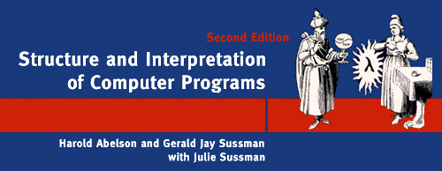

# [Структура и интерпретация компьютерных программ](../../README.md#Структура-и-интерпретация-компьютерных-программ)

## Глава 2. Построение абстракций с помощью данных
### 2.1 Введение в абстракцию данных
  * [Упражнение 2.1](exercise_2_01.md#Упражнение-21)
  * [Упражнение 2.2](exercise_2_02.md#Упражнение-22)
  * [Упражнение 2.3](exercise_2_03.md#Упражнение-23)
  * [Упражнение 2.4](exercise_2_04.md#Упражнение-24)
  * [Упражнение 2.5](exercise_2_05.md#Упражнение-25)
  * [Упражнение 2.6](exercise_2_06.md#Упражнение-26)
  * [Упражнение 2.7](exercise_2_07.md#Упражнение-27)
  * [Упражнение 2.8](exercise_2_08.md#Упражнение-28)
  * [Упражнение 2.9](exercise_2_09.md#Упражнение-29)
  * [Упражнение 2.10](exercise_2_10.md#Упражнение-210)
  * [Упражнение 2.11](exercise_2_11.md#Упражнение-211)
  * [Упражнение 2.12](exercise_2_12.md#Упражнение-212)
  * [Упражнение 2.13](exercise_2_13.md#Упражнение-213)
  * [Упражнение 2.14](exercise_2_14.md#Упражнение-214)
  * [Упражнение 2.15](exercise_2_15.md#Упражнение-215)
  * [Упражнение 2.16](exercise_2_16.md#Упражнение-216)

### 2.2 Иерархические данные и свойство замыкания
  * [Упражнение 2.17](exercise_2_17.md#Упражнение-217)
  * [Упражнение 2.18](exercise_2_18.md#Упражнение-218)
  * [Упражнение 2.19](exercise_2_19.md#Упражнение-219)
  * [Упражнение 2.20](exercise_2_20.md#Упражнение-220)
  * [Упражнение 2.21](exercise_2_21.md#Упражнение-221)
  * [Упражнение 2.22](exercise_2_22.md#Упражнение-222)
  * [Упражнение 2.23](exercise_2_23.md#Упражнение-223)
  * [Упражнение 2.24](exercise_2_24.md#Упражнение-224)
  * [Упражнение 2.25](exercise_2_25.md#Упражнение-225)
  * [Упражнение 2.26](exercise_2_26.md#Упражнение-226)
  * [Упражнение 2.27](exercise_2_27.md#Упражнение-227)
  * [Упражнение 2.28](exercise_2_28.md#Упражнение-228)
  * [Упражнение 2.29](exercise_2_29.md#Упражнение-229)
  * [Упражнение 2.30](exercise_2_30.md#Упражнение-230)
  * [Упражнение 2.31](exercise_2_31.md#Упражнение-231)
  * [Упражнение 2.32](exercise_2_32.md#Упражнение-232)
  * [Упражнение 2.33](exercise_2_33.md#Упражнение-233)
  * [Упражнение 2.34](exercise_2_34.md#Упражнение-234)
  * [Упражнение 2.35](exercise_2_35.md#Упражнение-235)
  * [Упражнение 2.36](exercise_2_36.md#Упражнение-236)
  * [Упражнение 2.37](exercise_2_37.md#Упражнение-237)
  * [Упражнение 2.38](exercise_2_38.md#Упражнение-238)
  * [Упражнение 2.39](exercise_2_39.md#Упражнение-239)
  * [Упражнение 2.40](exercise_2_40.md#Упражнение-240)
  * [Упражнение 2.41](exercise_2_41.md#Упражнение-241)
  * [Упражнение 2.42](exercise_2_42.md#Упражнение-242)
  * [Упражнение 2.43](exercise_2_43.md#Упражнение-243)
  * [Упражнение 2.44](exercise_2_44.md#Упражнение-244)
  * [Упражнение 2.45](exercise_2_45.md#Упражнение-245)
  * [Упражнение 2.46](exercise_2_46.md#Упражнение-246)
  * [Упражнение 2.47](exercise_2_47.md#Упражнение-247)
  * [Упражнение 2.48](exercise_2_48.md#Упражнение-248)
  * [Упражнение 2.49](exercise_2_49.md#Упражнение-249)
  * [Упражнение 2.50](exercise_2_50.md#Упражнение-250)
